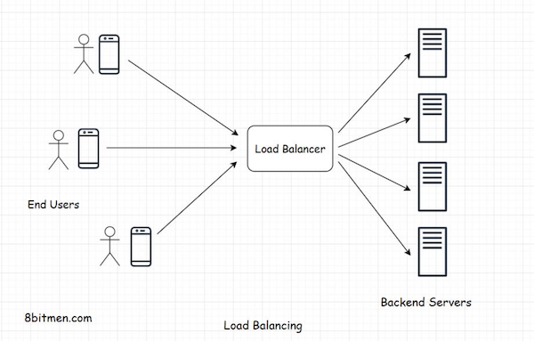
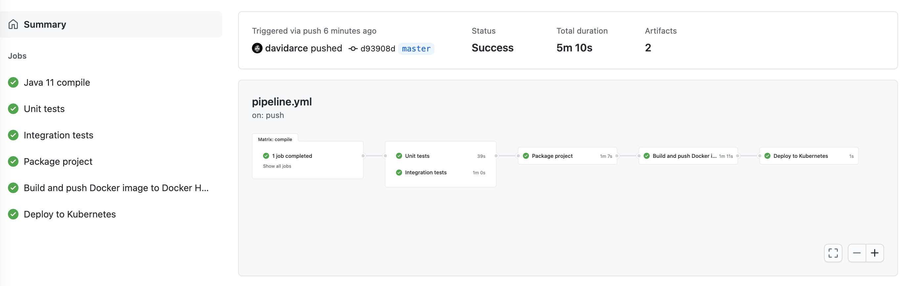
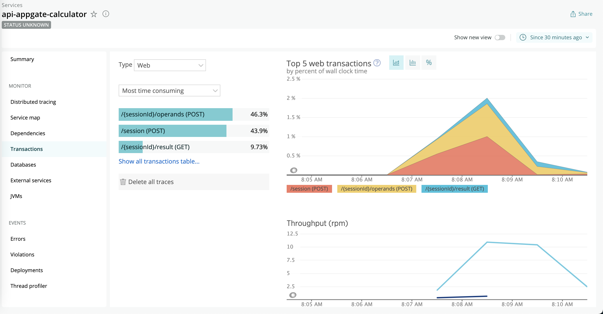
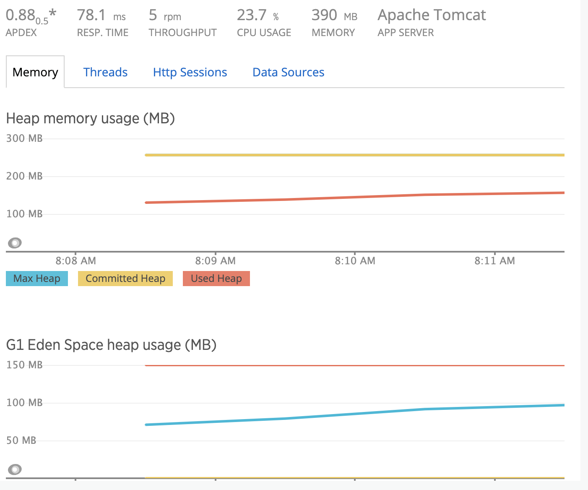
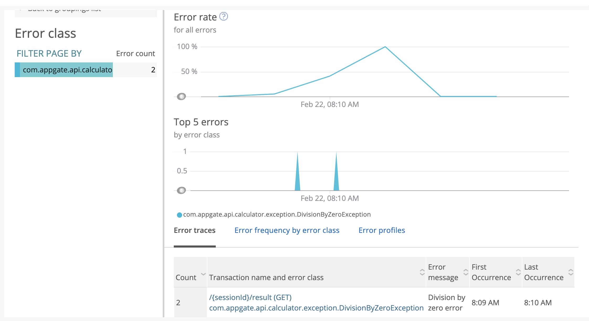

## 👋 Appgate calculator API
A RESTful API para calcular operaciones como ADD, SUBTRACT, MULTIPLY, DIVIDE and EXP

## ⛰ Escalabilidad de la API

 - La API está construida bajo el estilo de arquitectura REST, lo que significa que está totalmente desacoplada y cumple con los conceptos de "Single responsibility" y "Separation of concerns"

 - Este estilo de arquitectura nos permite desacoplar el cliente del servidor, y la escalabilidad se hereda por si sola. Al implementar una API bajo este estilo de arquitectura sin estado, podemos integrar diferentes componentes que se encargaran de otra capa a nivel fisico de la aplicación por ejemplo, la base de datos se encargará de almacenar la información del usuario y sesiones ejecutándose en otra máquina, esto nos permite escalar verticalmente cuando el tráfico aumente.

 - Finalmente para escalar horizontalmente (scaling out) la API implementaremos un Load balancer para que administre y enrute el tráfico hacia los distintos nodos que tengamos ejecutándose. El cliente tendrá un sólo punto de acceso que sería una API gateway(nuestro load balancer).


<p align="center">
 
</p>

## 📝 Atributos Relevantes de calidad 

- Escalabilidad
  
- Alta disponibilidad 

- Tolerancia al fallo

- Replicación

- Balanceo de carga

### 🤔 Posibles trade-offs

Construir aplicaciones distribuidas, altamente escalables tiene sus complicaciones al momento de administrarlas y monitorearlas esto se complica exponencialmente y se debe contar con una infraestructura muy bien estandarizada y automatizada. 

Afortunadamente hoy en dia existen varias herramientas y nuevas areas que nos facilitan la administración, despliegue y monitoreo de nuestras aplicaciones como por ejemplo soluciones cloud para eliminar soluciones on promise, centralization de logs con elasticsearch, despliegue continuo con jenkins, gitlab pipelines, github actions, monitoreo de aplicaciones con newrelic, orquestación de servicios con kubernetes y knative etc. 

#### ❗️ Importante
Es importante tener en cuenta que no siempre este tipo de arquitecturas son las que debemos seguir, para algunas compañias las aplicaciones monolíticas sirven perfectamente para la solución que quieren ofrecer, debemos analizar muy bien nuestros requerimientos y seleccionar la arquitectura correcta

Por ejemplo:

- Si queremos construir aplicaciones para nuestra organización de uso privado una "Single tier application" se adaptaría muy bien, ya que no esperamos manejar bastante tráfico. 
- Por el contrario si tenemos casos de usos complejos, la aplicacion tiene varios componentes tales como mensajera, chats en tiempo real, video streaming etc, y el tráfico incrementará exponencialmente en el futuro una arquitectura de micro-servicios funcionaría perfectamente.

## 🤓 ¿Utilizaría un tipo de API diferente a REST?

Como mencioné anteriormente todo depende de los requerimientos, y la solución que queramos ofrecerle a nuestro cliente final. Para esta prueba no veo necesario el uso de una REST api, podríamos utilizar una arquitectura de dos capas o "Two tier application". Nuestra interfaz y lógica de negocio pueden ir integradas en una misma aplicación y maquina, y nuestra capa de datos puede correr en otra máquina por el hecho de que debemos persistir la información de las sesiones, operaciones y transacciones de nuestros usuarios.

El escalamiento lo haríamos vertical en caso de que el tráfico aumente bastante.

## 🚦 Pipeline CI/CD

Para el proceso de integración continua usamos github actions, una vez se hace un push hacia la rama automaticamente comienza la validacion y despliegue de la aplicacion el cual esta construido con los siguientes steps:

- Compilación
- Pruebas unitarias
- Pruebas de integración
- Empaquetado/Instalación de la aplicación (jar)
- Construcción de la imagen de docker
- Push de la imagen de docker a un repositorio (Docker Hub)
- Despliegue

<p align="center">
 
</p>

## 💻 Tecnologías usadas
- Java 11
- Spring framework
- Spring AOP
- Spring Boot
- Newrelic
- MongoDB
- JUnit 5 & Karate for unit and Integration test
- Docker for deploying
- Docker compose para ejecutar la API en local

## ✊ Ejecutando la API
### Prerrequisitos
- Java 11
- Maven 3+
- Mongodb instalado en la máquina local y ejecutándose en localhost:27017
- Docker si se quiere ejecutar la aplicación en un contenedor

## 🔨 ¿Cómo usarla localmente?

```
git clone https://github.com/davidarce/api-appgate-calculator.git   

cd api-appgate-calculator

mvn clean package

java -jar target/api-appgate-calculator-0.0.1-SNAPSHOT.jar
```
## ⛴ ¿Cómo ejecutarla con docker-compose?

```
git clone https://github.com/davidarce/api-appgate-calculator.git   

cd api-appgate-calculator

docker-compose up -d --build 
```

Ahora puedes acceder la API con base-path: http://localhost:8080/api/calculator

# 🔛 Endpoints

[](https://app.getpostman.com/run-collection/77a27fdf5f9392b53810)

```
Create Session:

- POST    /api/calculator/session - Create a new session

Operands:

- POST     /api/calculator/:sessionId/operands - Send a operand

Result:

- GET     /api/calculator/:sessionId/result?operator=:operator

Auditory transactions

- GET     /api/calculator/:sessionId/transactions

```

## Http Status Code Resumen

```
200 OK - Everything worked as expected
201 OK - Resource created
202 Accepter - Request has been accepted for further processing.
400 Bad request - The request due to something that is perceived to be a client error 
404 Not Found - The requested resource does not exist
500 Internal Server error - The server has encountered a situation it doesn't know how to handle.
```
## Ejemplos

### Create Session

###### Request

```
POST /api/calculator/session
```
##### Response
`Ok 201 created`
```
{
    "sessionId": "a43dddcf-c931-4845-8662-b2eca2847bc4"
}
```
### Add Operands

###### Request

```
POST /api/calculator/a43dddcf-c931-4845-8662-b2eca2847bc4/operands
```

Body

```
{
	"number": "10",
}
```

##### Response
```
202 Accepted
```

### Result operation
###### Request

```
GET /api/calculator/a43dddcf-c931-4845-8662-b2eca2847bc4/result?operator=ADD
```

##### Response
```
{
    "result": "30"
}
```

### Auditory transactions
###### Request

```
GET /api/calculator/a43dddcf-c931-4845-8662-b2eca2847bc4/transactions
```

##### Response
```
[
    {
        "id": "6032d6418d96ba5b3ff31ee7",
        "userSessionId": "1da66947-277c-4592-8c29-53ab5fafce2b",
        "action": "ADD_OPERAND",
        "success": true,
        "stackTrace": null,
        "createdAt": "2021-02-21T16:53:05.482"
    },
    {
        "id": "6032d63c8d96ba5b3ff31ee6",
        "userSessionId": "1da66947-277c-4592-8c29-53ab5fafce2b",
        "action": "CREATE_SESSION",
        "success": true,
        "stackTrace": null,
        "createdAt": "2021-02-21T16:53:00.989"
    }
]
```

## 📚 Documentación API

En el siguiente link se puede visualizar la documentación con OpenAPI [URL](http://localhost:8080/api/calculator/documentation)

## 👀 Observabilidad API con Newrelic

Newrelic una plataforma de observabilidad sencilla pero potente que nos ayuda con el monitoreo de nuestra aplicación, en esta plataforma podemos ver los datos de desempeño, infraestructura, trace de errores y mucho más

### APM (Application performance monitoring)

Podemos visualizar las transacciones en tiempo real

<p align="center">
 
</p>

### Información de la JVM 

<p align="center">
 
</p>

### Errores de la aplicación

<p align="center">
 
</p>
